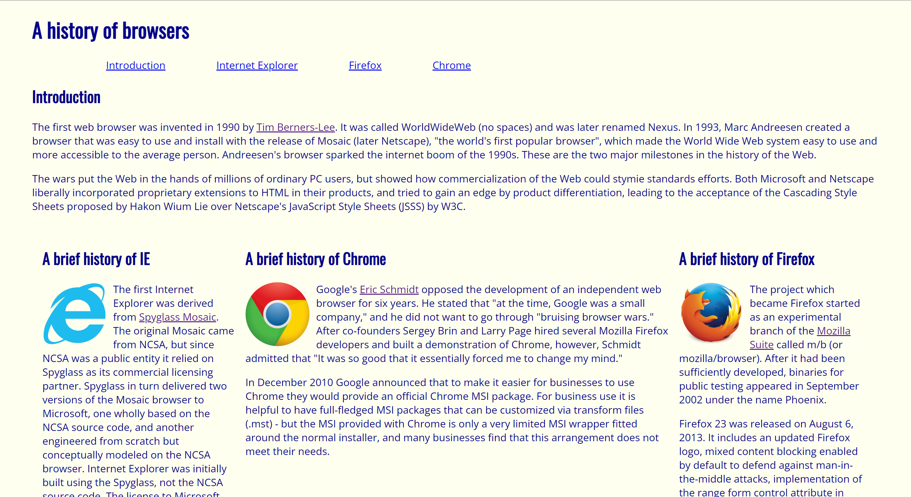
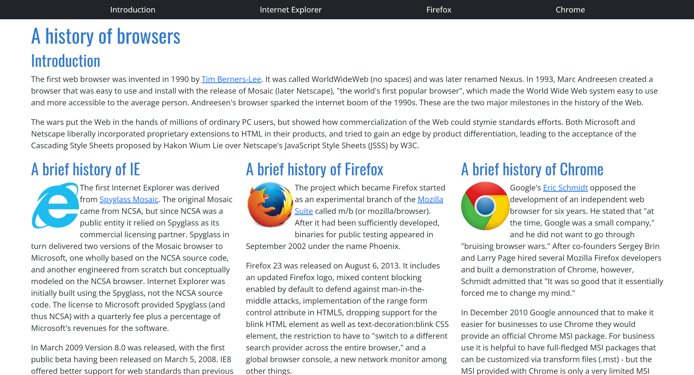

## My prior experience
Before the past two weeks, I had absolutely no idea how to design a website. Unlike many other programmers, I never learned HTML or any of the corresponding UI frameworks, so learning all about a UI was completely new to me. Of course, I had seen HTML code and copied and pasted code that was given to me, but I never understood what I was reading or using. I haven’t ever been interested in working with websites and applications, so I felt that I didn’t need to put in the effort to learn the tools associated with UI design. Although I still don’t have any intent to utilize UI frameworks throughout my career post-graduation, I do appreciate the opportunity to gain experience working with these tools.

## Stepping into HTML, CSS, and Bootstrap 5
My lack of experience made working with HTML, CSS, and Bootstrap 5 very challenging. Going through the freeCodeCamp lessons helped me get started in HTML, but I found it extremely difficult to gain an intuitive understanding of what tags and formatting I needed to be using to achieve a desired goal. The documentation for the UI frameworks was also hard to navigate for me, so completing tasks took a lot longer than anticipated. Working with pure HTML and CSS was painful and learning Bootstrap 5 was super helpful in relieving that stress. 

The Bootstrap 5 framework significantly simplified creating certain elements for tasks in the websites that I created. In return for the invested time and effort that I had to put in, the resulting websites made with Bootstrap were a lot more flexible and aesthetically pleasing. It was easier to create things like general margins, padding, navigation bars, dropdown menus, and columns. Using raw HTML and CSS takes a ton of time, so incorporating a framework like Bootstrap decreases the amount of struggles you must go through when creating a user interface. 

## A simple website comparison
Here is a comparison of an extremely simple website that I created from the practice WODs over the past couple weeks. On the left is the implementation using pure HTML and CSS and on the right is the execution using Bootstrap 5.

  
  

As you can see, the website created with Bootstrap is formatted a lot better. When I was creating columns for the website content in raw HTML, I ran into the issue of the webpage looking differently whenever the window was resized. This problem was solved in the Bootstrap implementation. Additionally, the navigation bar with Bootstrap was significantly improved. This is just a simple example of how Bootstrap 5 improved websites that I worked on, but this elevation can be seen in a lot of other websites that utilize UI frameworks.
