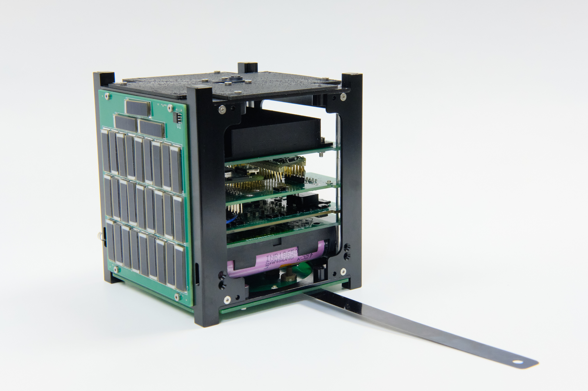

The Artemis CubeSat Kit is a project developed by the Hawaii Space Flight Laboratory (HSFL). The goal of Artemis is to provide educational institutions with a low-cost cubesat kit that can be integrated into school curriculums. This project will be able to expose students to the aerospace industry through a more accessible kit that contains all subsystems of a fully functioning passive small satellite. The Artemis team is currently working on finalizing subsystem designs, obtaining components for fabrication, and completing software integration.

Within this project I am a software assistant to the full-time employees at HSFL. Through this role I help to develop code for the satellite’s agents and framework. I also document, test, and integrate the hardware and software of various sensors and components for multiple subsystems. Additionally, I help the avionics team to fabricate PCBs for delivery of the kits.

I was offered this position on the Artemis team because of my work on the Ke Ao satellite and it has helped to refine and grow the skills I developed by being a part of Team Laniakea. This project has helped me learn more about software development and how to efficiently design frameworks. I’ve also been able to grow my soldering and programming skills. 

