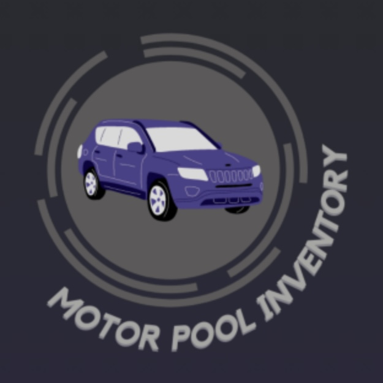

One of the NIWC intern projects that my team worked on was to create a functional application that would improve the efficiency of taking motor inventory in the Navy. We were given complete control over the specifics of the app implementation and design. Overall, my team finished the research and programming of the motor inventory app in about a week and a half.

My role within the project was to implement the optical character recognition (OCR) software and design the user interface (UI). To execute OCR, I used the text recognition packages from ML Kit for Firebase. The UI was designed on Canva and integrated using Android Studio. The other team members helped with general integration and incorporation of the database using MongoDB.

All of my group members hadn’t used Android Studio or MongoDB before, so this was a learning experience for each of us. This was also my first time creating an app, so being able to produce a useful tool that my team was proud of was a very rewarding experience. In addition to the technical skills I gained, I also learned a lot about teamwork and collaboration. Since we were given control over all aspects of the app, numerous decisions and compromises had to be made.

