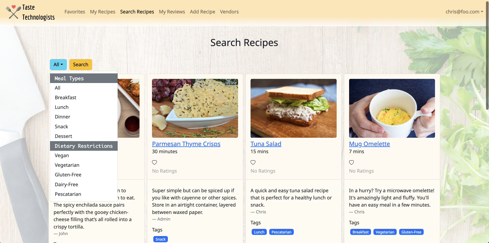

  

[Taste Technologists](https://taste-technologists.github.io/) is a web application developed as a final project for a software engineering course taken at UH Manoa. This application was designed for college students with common kitchen resources, basic cooking skills, and limited access to ingredients. Recipes located on the website are healthier alternatives to students ordering take out. The Taste Technologists application provides college students with easy and delicious recipes that can be made using minimal kitchen facilities, ingredients that are available within walking distance of UH Manoa, suit local taste sensibilities, and can be filtered via dietary restrictions. Each individual recipe also contains an estimated cost per serving, number of servings per recipe, and how long it takes to make. Below is a screenshot of the Search Recipes page on the actual Taste Technologists application.

  

This group project was managed using issue driven project management, so team members could claim tasks once they completed their current task. Because of this format, I worked on numerous different aspects of the web application. In Milestone 1 I worked on the user interface and back-end development for the recipes. This included implementing the recipe card and the add recipe form. Additionally, I reworked the navigation bar to reflect what each user could access. For Milestone 2 I implemented the profile collection for users so each recipe would have an associated user. I also added the user’s display name to the recipe display and improved the add recipe form. TestCafe tests and an updated navigation bar were also completed in this milestone. Milestone 3 consisted of completing final changes to the web application. I worked on allowing the owner of recipes to delete their recipes, updated the vendor’s navigation bar, and added recipes to the default data. Through each milestone I worked on a mixture of front-end and back-end components to help accomplish the different goals for this project.

  
  

In this project I was able to develop and refine my software engineering skills in Meteor, React, and Bootstrap. Additionally, I learned how to integrate deployment through Digital Ocean and tests through TestCafe to fully execute a web application. I also learned about issue driven project management and the distinctive styles of project management that are out there. Overall, I gained a lot of knowledge about the lifecycle of projects and the different tools used to develop web applications. I started out this class with no experience in web development, so finishing the semester having completed an entire application with my team has been extremely rewarding.
